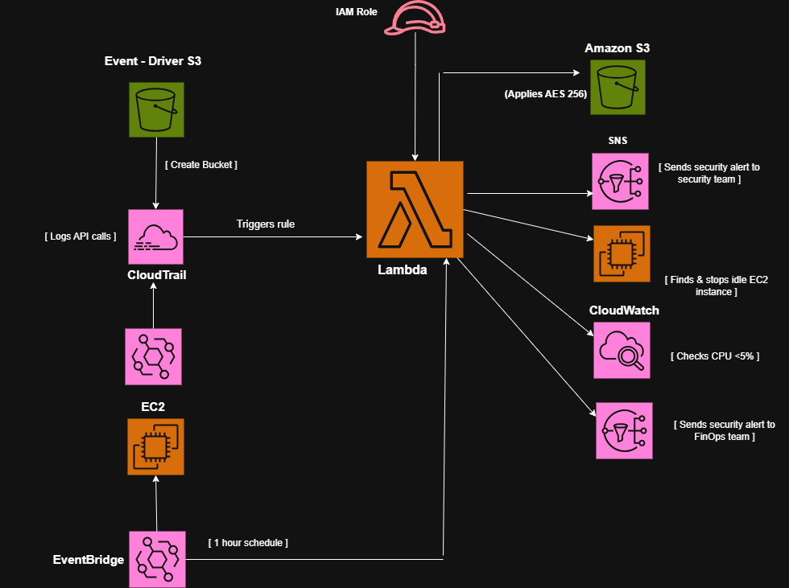

# AWS Event-Driven Security & Cost Optimization Automation

## Overview
An automated cloud security and FinOps system built on AWS using Terraform. It automatically enforces AES-256 encryption on new unencrypted S3 buckets and detects/terminates idle EC2 instances.

## Architecture Diagram

## Architecture
- **IaC:** Terraform
- **Compute:** AWS Lambda (Python)
- **Monitoring & Events:** AWS CloudTrail, EventBridge, CloudWatch
- **Storage & Security:** AWS S3, IAM Roles/Policies

## How to Deploy
1. Clone this repository.
2. Initialize Terraform: `terraform init`
3. Review plan: `terraform plan`
4. Deploy infrastructure: `terraform apply`

 git clone [https://github.com/joshijay45/aws-security-cost-automation.git]
 cd aws-security-cost-automation.git

## Cleau up the infrastrucuture 

1. `terraform destroy`